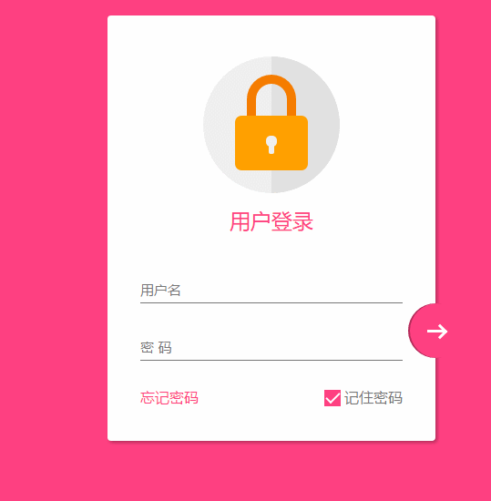
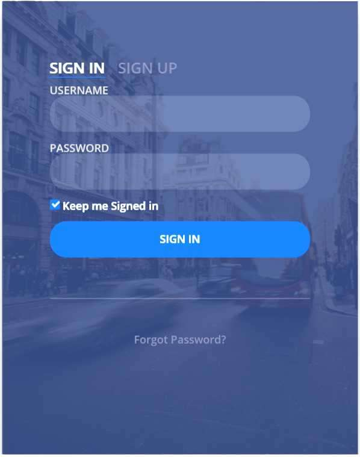

# 进阶学习前端语言和常用框架

## 任务说明
经过第一次任务，相信你们对前端开发已经有了一定的了解，这一次我们将进一步学习HTML5的新特性以及前端开发的另外两门重要语言——CSS和JavaScript（简称JS）。CSS是决定页面布局显示的样式表，使网页呈现出精美的画面; JS是前端主流的脚本语言之一，使得网页具有交互性。本次任务要求你们熟练掌握CSS以及热门的CSS框架Bootstrap; 掌握并能熟练使用JS和 jQuery 插件。

## 任务要求
1. 学习HTML5，掌握表单标签/输入类型/表单属性以及a标签p标签等重要的常用标签;了解HTML5音频/视频/画布/SVG等内容。

2. 学习CSS（CSS3），在掌握基本的用法后进一步学习以下内容：
 - 盒子模型
 - 布局方式
 - 伪类
 - 伪元素
 - 复杂选择器
 - CSS3过滤
 - CSS3动画
 - CSS3多列

3. 学习Bootstrap的使用，掌握Boots的主要样式和插件，有兴趣的可以了解Boots的实现语言Less或Sass，了解移动端优先的响应式实现，并着重掌握以下内容：
 - 栅格系统
 - 表单样式
 - 表格样式
 - 按钮样式
 - 模态框

4. 学习JS，了解JavaScript和Java的区别，了解浏览器对JS的兼容性问题。着重掌握以下知识点：
 - 基本数据类型
 - Object对象
 - 事件绑定
 - 表单提交
 - 节点或属性的增删查改等常用操作

5. 进阶学习JS，了解原型链/闭包/高阶函数/Ajax/事件代理等知识

6. 掌握jQuery的使用。jQuery是一个快速、简洁的JavaScript框架，是一个优秀的JavaScript代码库（或JavaScript框架）。jQuery封装JavaScript常用的功能代码，提供一种简便的JavaScript设计模式，优化HTML文档操作、事件处理、动画设计和Ajax交互。
jQuery是一个很重要的前端框架，多数主流网站都使用了它，因此要求大家仔细学习，熟练运用。以下几点是常用的jQuery知识点，要求着重掌握：
  - 入口函数
  - 选择器
  - 筛选函数
  - 样式操作
  - 属性操作
  - DOM操作
  - 事件
  - Ajax
  - jQuery插件

## 检查内容
1. 使用Bootstrap配合JS继续完善上一次任务的登录页面，完成以下效果图（二选一），并且实现：
 - CSS样式兼容主流浏览器
 - JS兼容主流浏览器
2. 使用JS实现学生信息管理系统，实现增删查改功能，并合理使用JS数据类型，具体功能如下：
 - 添加学生（姓名/性别/学号/年级/专业）
 - 输入学号搜索学生
 - 通过学号删除学生
 - 通过学号修改学生信息
 - 使用localStorage保存学生信息
 - 通过浏览器console命令行操作即可（不要求图形化界面）

注： 新建`F1`文件夹，将本次任务所有文件放入此文件夹, 同时附上你们的效果图，要求单张效果图大小<200K。

##### 效果图一

##### 效果图二

## 加分项
1. 登录页面实现响应式布局
2. 使用jQuery插件完成上述检查项
3. 检查项二实现图形化界面可直接获得A+（要求具有一定美观性，使用Boots实现）

## 任务期限
7.25 晚上8点

- 学习CSS`1天`
- 学习Boots`1天`
- 深入学习JS`2天`
- 学习jQuery`1天`
- 完成检查项一`1天`
- 完成检查项目二`1天`

PS: 这样的时间安排已经很充足，F1和F1相比具有一定的难度提升，所以还请各位认真对待，严格按照时间安排来完成任务。提前完成有加分的哦～

## 相关教程
- [CSS3教程1](http://www.w3school.com.cn/css3/index.asp)
- [CSS3教程2](https://www.runoob.com/css3/css3-tutorial.html)
- [JavaScript教程1](http://www.w3school.com.cn/js/index.asp)
- [JavaScript教程2(进阶)](https://www.liaoxuefeng.com/wiki/001434446689867b27157e896e74d51a89c25cc8b43bdb3000)
- [Bootstrap3官网中文文档](http://v3.bootcss.com/)
- [Bootstrap教程](https://www.runoob.com/bootstrap/bootstrap-tutorial.html)
- [jQuery入门教程](http://www.w3school.com.cn/jquery/index.asp)
- [jQuery常用知识点总结](http://www.cnblogs.com/xiaohui123-com/p/6430843.html)

## 推荐资源
这几次任务有很多同学编码或命名非常不规范，以下是很好的规范化教程，希望这一次检查的时候不要再出现编码或命名不规范的问题。
- [前端编码规范-HTML](http://blog.csdn.net/xllily_11/article/details/51249029)
- [前端编码规范-JS](http://caibaojian.com/toutiao/5938)
- [前端编码规范-CSS](http://blog.csdn.net/xllily_11/article/details/51249120)
- [前端编码规范总结](http://www.cnblogs.com/youfeng365/p/5846683.html)
- [命名规范](http://blog.csdn.net/dong_pt/article/details/50948033)

## 提示
- 登录界面`效果图1`会比`效果图2`难一些，但是更具有挑战性，更能锻炼前端基础，希望同学们选择`效果图1`，同时在分数上我也会适当提高。
- 如果习惯看视频教程的同学可以选择[极客学院](http://www.jikexueyuan.com/)或者[慕课网](http://www.imooc.com/)这样的网站进行学习，视频会比网页教程有更好的学习效果，不过比较消耗时间。
- 提前完成任务的同学可以尝试了解一些其它的前端框架，例如Vue/Webpack/Amazy UI/Less/Sass/Webpack等
